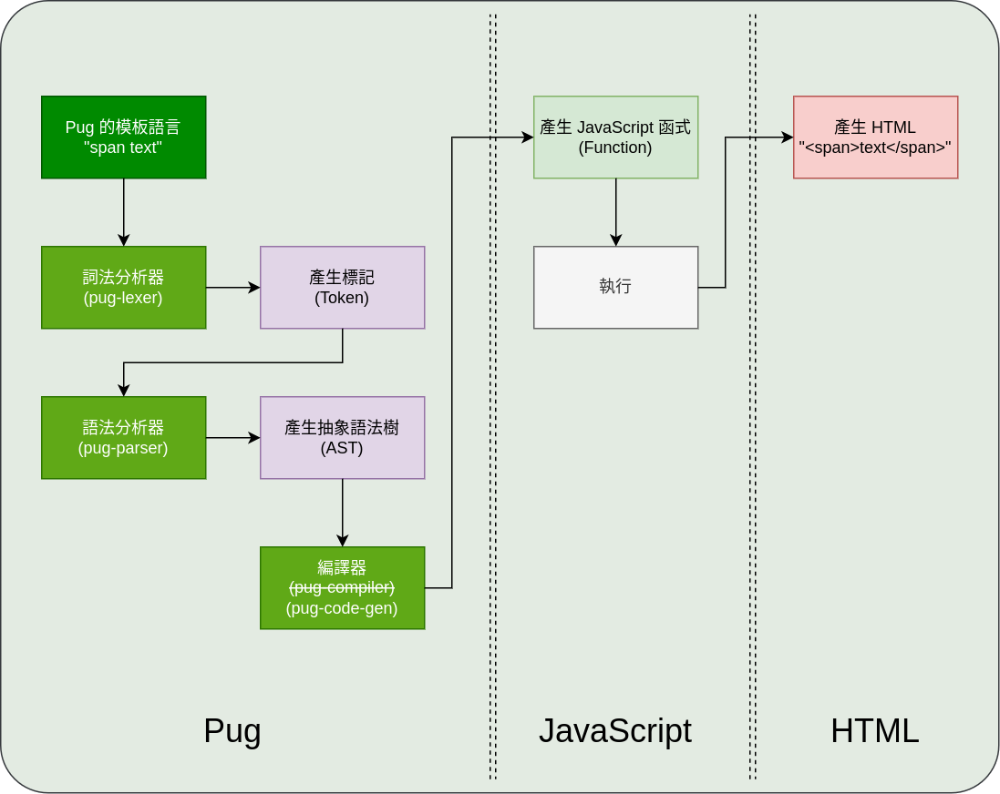

# 附錄：PUG 的編譯流程
在解釋編譯流程之前，先簡單介紹一些 PUG 這東西。


<!-- TOC depthfrom:2 orderedlist:false -->

- [這是一套受歡迎的模板引擎](#%E9%80%99%E6%98%AF%E4%B8%80%E5%A5%97%E5%8F%97%E6%AD%A1%E8%BF%8E%E7%9A%84%E6%A8%A1%E6%9D%BF%E5%BC%95%E6%93%8E)
    - [它有自己的語法](#%E5%AE%83%E6%9C%89%E8%87%AA%E5%B7%B1%E7%9A%84%E8%AA%9E%E6%B3%95)
    - [那它是怎麽編譯的呢？](#%E9%82%A3%E5%AE%83%E6%98%AF%E6%80%8E%E9%BA%BD%E7%B7%A8%E8%AD%AF%E7%9A%84%E5%91%A2)
    - [如何使用漏洞？](#%E5%A6%82%E4%BD%95%E4%BD%BF%E7%94%A8%E6%BC%8F%E6%B4%9E)
- [參考](#%E5%8F%83%E8%80%83)

<!-- /TOC -->


## 這是一套受歡迎的模板引擎


因爲 HTML 實在是不好寫，也不好維護，於是前人們設計了這個工具。

### 它有自己的語法
舉個簡單的例子。
```pug
table.className#ID(attr="value")
  tr
    th 標題一
    th 標題二
  tr
    td 表格一
    td 表格二
```
上面的 pug 語法經過編譯後會產生下面的 HTML
```html
<table id="ID" attr="value" class="className">
  <tr>
    <th>標題一</th>
    <th>標題二</th>
  </tr>
  <tr>
    <td>表格一</td>
    <td>表格二</td>
  </tr>
</table>
```

### 那它是怎麽編譯的呢？
流程大致如下：


```
         下面這坨直接黑箱起來統稱編譯
PUG -> (詞法分析 -> 語法分析 -> 編譯) -> JavaScript -> HTML
```

這是維基百科的定義：
> 編譯器 (compiler) 是一種電腦程式，它會將某種程式語言寫成的原始碼（原始語言）轉換成另一種程式語言（目標語言）。

### 如何使用漏洞？
這段其實跟這篇文章沒有直接關係，純粹承接主文章用的而已。

由於主文章在探討的是利用原型鍊污染達成目的，因此就這個結構來看的話，感覺每個環節都有機會成爲目標。不過實際嘗試污染攻擊後，會發現基本上只能透過一些「有定義屬性且在特定流程下該屬性沒有預設值(或是採用不嚴謹的比對或自動轉型)的情況」才可達成有效的污染攻擊。  

很繞口？用程式碼來講可能比較直接點。

[pollution-lib.js](scripts/pollution-lib.js)
```js
// 此函式定義在 ./scripts/pollution-lib.js
// 可從 ./scripts/pollution-usage.js 執行看到結果

function calc(data) {
    let amount = 0;
    data.forEach(good => {
        // 若還有庫存才計算
        // 這樣的寫法看起來沒問題，但是原型鍊污染最喜歡這種寫法
        // 一旦 good.quantity 是 undefined 的時候，這裡就很刺激了
        if (good.quantity) {
            amount += good.quantity * good.price;
        }
    });

    console.log("總收益", amount);
}
```


## 參考
- [維基百科：詞法分析](https://zh.wikipedia.org/wiki/%E8%AF%8D%E6%B3%95%E5%88%86%E6%9E%90)
- [維基百科：語法分析](https://zh.wikipedia.org/wiki/%E8%AF%AD%E6%B3%95%E5%88%86%E6%9E%90)
- [維基百科：編譯器](https://zh.wikipedia.org/wiki/%E7%B7%A8%E8%AD%AF%E5%99%A8)
- [認識 pug 模板語法](https://medium.com/unalai/%E8%AA%8D%E8%AD%98-pug-%E6%A8%A1%E6%9D%BF%E8%AA%9E%E6%B3%95-74adeee56468)
- [jade(pug) 的線上編輯器](http://aramboyajyan.github.io/online-jade-template-editor/)
- [如果你是常切版的前端工程師，你一定要知道pug!](https://northbei.medium.com/%E5%A6%82%E6%9E%9C%E4%BD%A0%E6%98%AF%E5%B8%B8%E5%88%87%E7%89%88%E7%9A%84%E5%89%8D%E7%AB%AF%E5%B7%A5%E7%A8%8B%E5%B8%AB-%E4%BD%A0%E4%B8%80%E5%AE%9A%E8%A6%81%E7%9F%A5%E9%81%93pug-8b2cbc0a784c)


